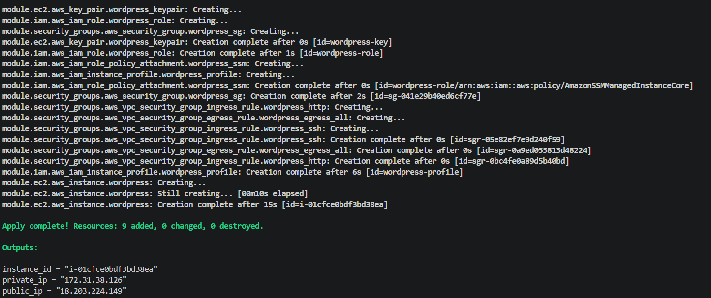
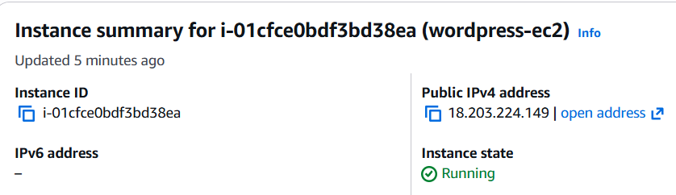
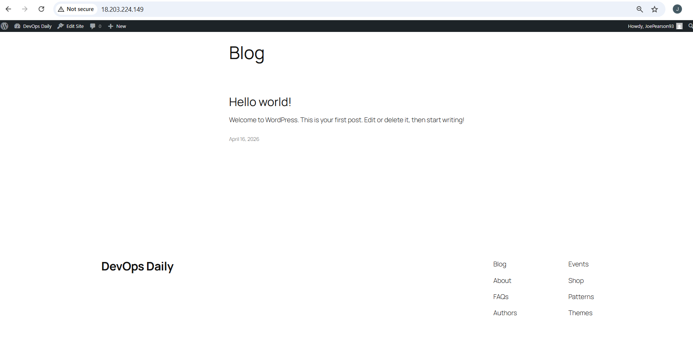

WordPress is a Content Management System (CMS) — software that lets you build and manage a website without needing to code everything from scratch.

🧠 In simple terms

Think of WordPress like this:

Frontend (what users see): your website
Backend (what you control): a dashboard to edit content

Instead of writing HTML/CSS manually, you:

Log into /wp-admin
Create pages/posts
Choose a theme
Install plugins
⚙️ What WordPress actually does

It handles the core parts of a website for you:

📝 Create and manage content (posts, pages)
🎨 Control design with themes
🔌 Add features with plugins (contact forms, SEO, etc.)
👥 Manage users (admin, editor, etc.)
🗄️ Store data in a database (usually MySQL)

📌 What I Built

I used Terraform to deploy a full WordPress stack on AWS. The infrastructure includes an EC2 instance configured to host a WordPress site, along with the necessary security groups to allow HTTP and SSH access.

The EC2 instance is automatically provisioned using a user data script to install and configure all required dependencies such as Apache, PHP, MySQL, and WordPress itself. Once deployed, the application is accessible via a public endpoint.

All infrastructure components were provisioned and managed entirely through Terraform, demonstrating Infrastructure as Code (IaC) principles.

## 📸 Screenshots

### Terraform Apply

### Terraform Output

### EC2 Instance Running

### WordPress Site

### WordPress Dashboard

🏗️ Terraform Code Structure

The project is structured to follow best practices for readability, scalability, and maintainability:

main.tf – Defines the core infrastructure, including provider configuration and resource definitions.
variables.tf – Contains input variables to make the configuration reusable and flexible.
outputs.tf – Exposes useful information such as the public IP or URL of the EC2 instance.

To improve modularity and maintain a clean codebase, I separated key components into reusable modules:

## 📁 Project Structure

├── README.md
├── images
│   ├── admin-dashboard.png
│   ├── ec2-instance-running.png
│   ├── terraform-apply.png
│   └── wordpress-home.png
├── main.tf
├── modules
│   ├── ec2
│   ├── iam
│   └── security_groups
├── outputs.tf
├── terraform.tfstate
├── user_data.sh
└── variables.tf

This modular approach helped enforce a DRY (Don't Repeat Yourself) codebase and made the infrastructure easier to extend or modify.

I also ensured the configuration was idempotent, meaning repeated Terraform runs produce the same result without unintended changes.

📚 What I Learnt

This was my first time using Terraform, and I became familiar with:

Writing Terraform configuration files
Using the Terraform CLI (init, plan, apply)
Navigating the Terraform documentation and registry to find providers and modules
Structuring infrastructure code using variables, outputs, and modules
Applying best practices such as modularisation, idempotency, and DRY principles

I also gained a better understanding of how infrastructure is provisioned and managed declaratively.

⚠️ Issues Encountered and Fixes

One of the main challenges I faced was with the user data script. Initially, the script failed to execute properly, which resulted in WordPress not being installed and the EC2 instance not being accessible via SSH.

To troubleshoot this:

I checked cloud-init and system logs on the EC2 instance
Reviewed /var/log/cloud-init-output.log to identify where the script was failing
Iteratively refined the script to ensure proper installation and service startup

The issue required careful debugging, but going through the logs helped narrow down the root cause and fix the configuration.

This process improved my understanding of how EC2 bootstrapping works and how to debug infrastructure-level issues effectively.